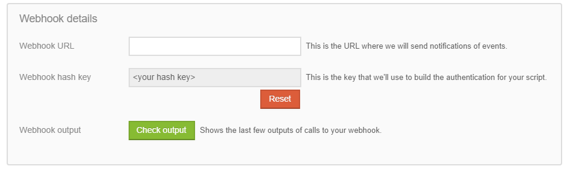

# Lenddo PHP SDK

[](https://travis-ci.org/Lenddo/php-lenddo) [](http://codecov.io/github/Lenddo/php-lenddo?branch=master) [](https://packagist.org/packages/lenddo/sdk)

## Installation
The Lenddo PHP SDK is available via Composer and can be installed by running the `composer require lenddo/sdk` command.

More information can be found here: https://packagist.org/packages/lenddo/sdk

## Introduction
### REST Services
The [ServiceClient](#result-service-client) and [WhiteLabelClient](#white-label-client) This SDK will allow you to contact Lenddo's REST based services. It acts as a wrapper around the  popular **GuzzleHttp\Guzzle** package. Calling the methods on the `ServiceClient` or `WhiteLabelClient` classes will return a `Psr\Http\Message\ResponseInterface` object from the Guzzle Library.

The **ServiceClient** will allow you to retrieve the scoring and verification results from Lenddo.

The **WhiteLabelClient** will allow you to utilize Lenddo services without any Lenddo branding. This method of implementation is the most complex but allows you to fully customize your users' experience.

### Webhook Services
While the REST Services allow you to retrieve the results of a scoring or verification job they require you to continue contacting Lenddo until results are available. For many situations this is less than ideal, due to this Lenddo offers a webhook service. The **webhook service** is a feature which allows you to receive a POST request at a designated URL the moment a result is available. For more please continue to the [Webhook Authentication](#webhooks) section of this documentation.

## Table of Contents
<!-- START doctoc generated TOC please keep comment here to allow auto update -->
<!-- DON'T EDIT THIS SECTION, INSTEAD RE-RUN doctoc TO UPDATE -->


- [Result Service Client](#result-service-client)
  - [Create the Lenddo REST Service Client](#create-the-lenddo-rest-service-client)
    - [Note about APPLICATION_ID](#note-about-application_id)
    - [Get the score for your Lenddo Application](#get-the-score-for-your-lenddo-application)
    - [Get the verification results for your Lenddo Application](#get-the-verification-results-for-your-lenddo-application)
    - [Get your Lenddo Application Decision](#get-your-lenddo-application-decision)
- [White Label Client](#white-label-client)
  - [Introduction](#introduction)
  - [Instantiating the Client](#instantiating-the-client)
    - [PartnerToken](#partnertoken)
      - [Errors](#errors)
    - [CommitPartnerJob](#commitpartnerjob)
      - [Errors](#errors-1)
  - [Error Handling](#error-handling)
- [Webhooks](#webhooks)
  - [Webhook Setup](#webhook-setup)
  - [Using the SDK](#using-the-sdk)
    - [Requirements](#requirements)
    - [Optional Configuration](#optional-configuration)
      - [Host](#host)
      - [Port](#port)
      - [RequestPath](#requestpath)
    - [Webhook Call Details](#webhook-call-details)
      - [Payload](#payload)
        - [Events](#events)
          - [verification_complete](#verification_complete)
          - [scoring_complete](#scoring_complete)
          - [application_decision_complete](#application_decision_complete)
          - [logged_in](#logged_in)
    - [Usage](#usage)

<!-- END doctoc generated TOC please keep comment here to allow auto update -->

# Result Service Client
The `ServiceClient` allows partners to retrieve scoring and verification results from Lenddo REST API's.

## Create the Lenddo REST Service Client
```php
<?php

// Fill out the ID & Secret provided to you by your contact at Lenddo.
$id = '';
$secret = '';

// Require the Composer autoloader
require 'vendor/autoload.php';

// Instantiate the Lenddo Service Client
$client = new Lenddo\ServiceClient( $id, $secret );
```

### Note about APPLICATION_ID
**APPLICATION_ID** is the value you passed to Lenddo to uniquely identify the application coming through. In previous
instances you may have read this being referred to as a _client_id_ - it's important to understand that the purpose of
these two items are the same despite having different names.

### Get the score for your Lenddo Application
Please refer to the [scoring response documentation](docs/scoring_response.md) to understand the returned 
structure of the verification object.

To retrieve the score you'll need the application ID and the partner script ID that you used to create the application.

```php
<?php

$response = $client->applicationScore('APPLICATION_ID', 'PARTNER_SCRIPT_ID');

// Get the Status Code for the response
$status_code = $response->getStatusCode(); // 200

// Retrieve the body of the response
$score_results = $response->getBody();

// Return the score value and reason flags.
$score_value = $score_results->score;
$score_flags = $score_results->flags;
```

### Get the verification results for your Lenddo Application
Please refer to the [verification response documentation](https://github.com/Lenddo/php-lenddo/blob/master/docs/verification_response.md) to understand the returned 
structure of the verification object.

To retrieve the verification you'll need the application ID and the partner script ID that you used to create the application.

```php
<?php

$response = $client->applicationVerification('APPLICATION_ID', 'PARTNER_SCRIPT_ID');

// Get the Status Code for the response
$status_code = $response->getStatusCode(); // 200

// Returns a JSON object for the requested verification.
$verification_results = $response->getBody();

$name_verified = $verification_results->verifications->name == 1;
$verification_reason_codes = $verification_results->flags; // array
```

### Get your Lenddo Application Decision
Please refer to the [application decision response documentation](docs/application_decision_response.md) to understand
the returned structure of the application decision object.

To retrieve the decision you'll need the application ID and the partner script ID that you used to create the application.

```php
<?php

$response = $client->applicationDecision('APPLICATION_ID', 'PARTNER_SCRIPT_ID');

// Get the status code for the response
$status_code = $response->getStatusCode(); // 200

$application_decision_results = $response->getBody();

// Get the decision
switch($application_decision_results->decision) {
    case "APPROVE":
        // approved logic here
        break;
    case "DENY":
        // deny logic here
        break;
    case "NO_DECISION":
        // logic for further testing of the applicant here
        break;
    default:
        // Notify necessary staff here
        throw new Error('Unknown Application Decision Result!');
}
```

# White Label Client
## Introduction
_Use Lenddo services while keeping your own branding_

The white label package comes in two service calls made to Lenddo which are meant to allow you to utilize Lenddo 
    services without having the user leave your own ecosystem.

1. The first service call is the **partnerToken** call which will allow you to send social network oauth tokens to
    Lenddo. These tokens will be used in the second step to provide scoring services for your client. This call returns
    a **profile_id** which you will be required to save so that you can send it to use for the second call.
2. The second call which you make to Lenddo will be the **commitPartnerJob** service call. This call creates a job for
    scoring based on the a one time use id _(known as the APPLICATION_ID)_, a list of **profile_ids** which you gathered from
    the first service call, and finally a **partner_script_id** which dictates how Lenddo will inform you of the results.

## Instantiating the Client
```php
<?php

// Fill out the ID & Secret provided to you by your contact at Lenddo.
$api_app_id = '';
$api_app_secret = '';

// Require the Composer autoloader
require 'vendor/autoload.php';

// Instantiate the Lenddo Service Client
$client = new Lenddo\WhiteLabelClient( $id, $secret );
```

### PartnerToken
**Note**: All token providers must be **OAuth 2.0**

PartnerToken has the following arguments:

1. **APPLICATION_ID** - this is the client id that you're posting the token for. This must match the APPLICATION_ID you use in
    the **CommitPartnerJob** step.

2. **provider** - this is the token provider. Valid values are as follows:
    `Facebook`, ` LinkedIn`, ` Yahoo`, ` WindowsLive`, or ` Google`

3. **oauth key** - this is the key returned by oauth for interacting with the token.
    > **note:** The **key** and **secret** are not your _application_ key and secret.
    > They're the values which are returned after a user successfully authenticates with the social network's oauth.

4. **oauth secret** - optional, leave `null` if not applicable. Some OAuth providers may return a secret, when this
    is returned Lenddo will required the secret to use the token.

5. **token data** - This is the raw token as it was received from the provider in Array format.
    This may include an **extra_data** key.

```php
<?php

$response = $client->partnerToken($APPLICATION_ID, 'Facebook', $oauth_key, $oauth_secret, $token_data);

// Get the Status Code for the response
$status_code = $response->getStatusCode(); // 200

// Retrieve the body of the response
$post_token_results = $response->getBody();

// Get the profile ID
$profile_id = $post_token_results->profile_id; // string - for example: 123FB
```

#### Errors
* **BAD_REQUEST** _HTTP Status Code: 400_
    Request was malformed, or missing required data.
    
* **INVALID_TOKEN** _HTTP Status Code: 400_
    Token data was missing required fields or fields had invalid values.

* **TOKEN_FAILURE** _HTTP Status Code: 400_
    Failure upon attempt to use the token.
    
* **INTERNAL_ERROR** _HTTP Status Code: 500_
    An internal error occurred. If this persists please contact a Lenddo Representative.

### CommitPartnerJob

CommitPartnerJob has the following arguments:

1. **partner script id** - Please reference the [developer section](https://partners.lenddo.com/developer_settings) 
    of the partner dashboard. This will define how you're notified of scoring results.

2. **application id** - This is essentially a one time use transaction id. Once this ID is used it cannot be used again.
    You can use this value in the [`ServiceClient::applicationScore`](#get-the-score-for-your-lenddo-application)
    to retrieve the score results.
    
3. **profile ids** - This is an array of ID's composed from the results of the
    [`WhiteLabelClient::PartnerToken`](#partnertoken) service call.

```php
<?php

// $profile_ids will be an array of the profile ID's that we've received as a response from PartnerToken
$profile_ids = array( '123FB' );

$response = $client->commitPartnerJob($partner_script_id, $APPLICATION_ID, $profile_ids);

// Get the Status Code for the response
$status_code = $response->getStatusCode(); // 200

// Retrieve the body of the response
$commit_job_results = $response->getBody();

// Get the profile ID
$success = $status_code === 200 && $commit_job_results->success = true;
```

#### Errors
* **BAD_REQUEST** _HTTP Status Code: 400_
    Request was malformed, or missing required data.
    
* **PARTNER_CLIENT_ALREADY_PROCESSED** _HTTP Status Code 400_
    This occurs when the specified *APPLICATION_ID* has already been used.
    
* **INTERNAL_ERROR** _HTTP Status Code: 500_
    An internal error occurred. If this persists please contact a Lenddo Representative.

## Error Handling
You can retrieve the body of an error via the following method:
```php
try {
    //.. your request code here
} catch ( Exception $e ) {
    $http_status = $e->getResponse()->getStatusCode(); // 400
    
    // {"message": "Missing required token field refresh_token.", "name": "INVALID_TOKEN"}
    $error_body = json_decode($e->getResponse()->getBody()->getContents());
}
```


# Webhooks
Webhooks allow partners to receive notification that results are complete along with the results of scoring or verification the moment they're available. This is the fastest and most efficient way to receive results from Lenddo.

## Webhook Setup
Before doing any code implementation you'll need to perform the following steps:

1. Navigate to the [Partners Dashboard](https://partners.lenddo.com) and **log in**
2. On the left hand menu click **developers** and navigate to [**settings**](https://partners.lenddo.com/developer_settings)
3. For each **partner script** that you want to receive notifications for:
    1. Take note of the **partner script id**
    2. Go to **webhook details** 
    3. Define a **webhook url** - this is the url that we will contact when results are available.
    4. Click **reset** near the **"Webhook Hash Key"** field and copy the new value.
    5. Click **save** at the bottom of the Partner Script settings.

## Using the SDK
### Requirements
You will need two pieces of information to use the authentication portion of the SDK:

1. The **Partner Script ID** found in step 3.1 of the **setup** section above.
2. The **Webhook Hash Key** found in step 3.4 of the **setup** section above.

### Optional Configuration
In addition to the standard configuration some environments may not have critical components available for proper authentication.

#### Host
You can specify a host if the internal PHP server does not see the same HOST value that our servers would send. This might happen if there is a load balancer in front of the server hosting PHP.

#### Port
Port is required if it's anything beyond the standard https port (443). If this value is anything different please provide it. Due to documented reasons we will not attempt to inspect the port the application is running on.

#### RequestPath
This field should include the path as well as the query string. Typically, this is available via `$_SERVER['REQUEST_URI'] and we will attempt to get it from this value. If however a url is being rewritten internally you will need to provide the proper value that an external party is using to communicate to this server.

### Webhook Call Details
Lenddo will call your server using a **POST** request. This will be done using the [Hawk Authentication](https://github.com/hueniverse/hawk) scheme. The purpose of this SDK is to wrap the authentication scheme in an easy-to-consume class so that you can hit the ground running.

#### Payload
The payload of the POST request is `application/x-www-form-urlencoded`. This means that it's similar to a user posting a form to your server. The contents of this request can be accessed via the `$_POST` superglobal in PHP.

The structure of the payload is as follows:
```php
$_POST = array(
    'APPLICATION_ID' => 'your_APPLICATION_ID_123', // this is the client id you sent to us when you passed the user to Lenddo
    'event' => 'scoring_complete',
    'result' => array(
        'score' =>  687,
        'flags' => []
    )
);
```

##### Events
Events describe why we're contacting you. There are four valid events:

###### 1. verification_complete
The application has been verified. If the verification was successful you can find the result in the `result` array. To understand how the `result` array should look like please refer to the [verification response documentation](docs/verification_response.md) 

###### 2. scoring_complete
The application has been scored. If the scoring was successful you can find the result in the `result` array. To understand how the `result` array should look please refer to the [scoring response documentation](docs/scoring_response.md)

###### 3. application_decision_complete
The application has received an APPROVE/DENY decision. If the decision was successful you can find the result in the `result` array. To understand how the `result` array should look please refer to the [application decision response documentation](docs/application_decision_response.md)

###### 4. logged_in
This occurs after the user has identified with us. Because they have not been submitted to our system just yet it is not guaranteed that you will not receive another logged_in notification for this user if they cancel or return with another browser in a small window of time. No data accompanies the `result` array with this request.

### Usage
On the endpoint / URL specified in step 3.3 above you should have the following code:

```php
use Lenddo\WebhookAuthentication;

$partner_script_id = '<webhook hash key from 3.1>';
$webhook_key = '<webhook hash key from 3.4>';

// None of the following fields must be defined. Please refer to the `Optional Configuration` Above
// If your environment does not require any of the custom option values, please omit this field.
$options = array(
    'Host' => 'public.dns.com'
    'Port' => 6050,
    'RequestPath' => '/the/path/we/call?query=string&as=well'
)

// Build the Authentication Client.
$authentication_client = new WebhookAuthentication($webhook_key, $partner_script_id, $options);

// Authenticate this request
if( $authentication_client->authenticateRequest() ) {
    $post_data = $_POST;
	/**
	*
	* Authentication was successful. Here you will want to perform any business logic before calling the
	*   webhook accepted method below. The reason for this is that if the business logic failed we 
	*   will attempt again to call your server with the same payload. This allows you to not miss calls
	*   from us regardless of what may have gone wrong.
	*
	**/
	$authentication_client->webhookAccepted();
}
```
