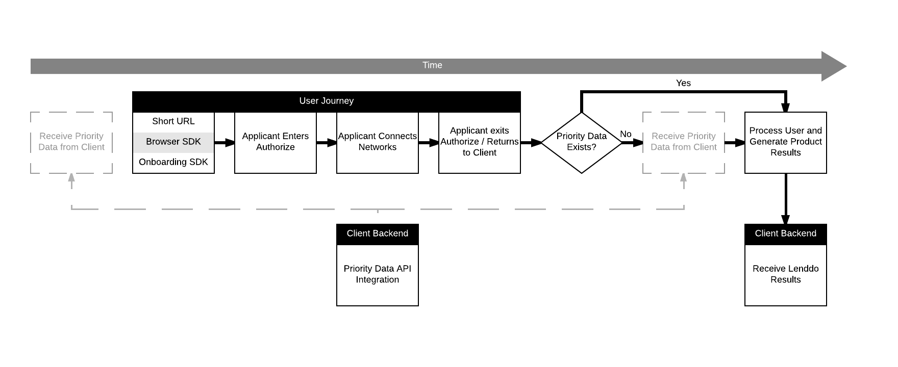

# Authorize API Client
_Provide additional data criticla for the onboarding experience._

The Authorize API Client provides asynchronous methods to communicate critical data to Lenddo that may impact the product
output. This data may be used for verification, scoring, decisioning etc.

<!-- START doctoc generated TOC please keep comment here to allow auto update -->
<!-- DON'T EDIT THIS SECTION, INSTEAD RE-RUN doctoc TO UPDATE -->
**Table of Contents**

- [Instantiating the Client](#instantiating-the-client)
- [PriorityData](#prioritydata)
  - [Workflow](#workflow)
    - [Diagram](#diagram)
  - [API](#api)
  - [Errors](#errors)
- [Error Handling](#error-handling)

<!-- END doctoc generated TOC please keep comment here to allow auto update -->


## Instantiating the Client
```php
<?php

// Fill out the ID & Secret provided to you by your contact at Lenddo.
$api_app_id = '';
$api_app_secret = '';

// Require the Composer autoloader
require 'vendor/autoload.php';

// Instantiate the Lenddo Service Client
$client = new Lenddo\AuthorizeApiClient( $api_app_id , $api_app_secret );
```

## PriorityData
### Workflow
Priority Data may be provided at any time when enabled for your parnter script. Please communicate with your Lenddo
representative on how to enable this feature if you require it. Priority data may be typical data (verification probes) 
or atypical data such as credit bureau reports or proprietary data owned by your business.

Data may be received at anytime before or after the user onboarding experience. When enabled for your account a user will
not be processed until _both_ the priority data is received _and_ the user completes the onboarding process.

#### Diagram


### API
PriorityData has the following arguments:

1. **partner_script_id** - This is your partner script ID that the user will be associated with. This partner script 
**must** have Priority Data enabled. 
2. **application_id** - this is the client id that you're posting the token for. This must match the APPLICATION_ID that
the user enters Authorize with. This ID is transactional and represents a single application within Lenddo.
3. **extra_data** - This is unstructured data which may be prudent to the product output. The information and structure 
**must** be communicated with Lenddo prior to sending it. Without this communication there is no ability to parse and understand
the incoming data. _must be an array_
4. **verification_data** - This is an optional argument which will allow you to send probe data with the verification object.
    * [Read verification documentation here](verification.md)

```php
<?php
$application_id = '20160418-130';

$extra_data = array(
	// Just a sample
	'credit_bureau_data' => array(
		// data here
	)
);

$verification = new Lenddo\Verification();
$verification->setFirstName('First Name')->setMiddleName('MN')->setLastName('Last Name');


$response = $client->priorityData($partner_script_id, $application_id, $extra_data, $verification);

// Get the Status Code for the response
$status_code = $response->getStatusCode(); // 200

// Retrieve the body of the response
$commit_job_results = $response->getBody();

$success = $status_code === 200;
```

### Errors
* **BAD_REQUEST** _HTTP Status Code: 400_
>    Request was malformed, or missing required data.
    
* **PARTNER_SCRIPT_PRIORITY_DATA_DISABLED** _HTTP Status Code 400_
>    This occurs when the specified *PARTNER_SCRIPT_ID* does not have priority data enabled. Please contact your Lenddo Representative
    
* **PRIORITY_DATA_ALREADY_EXISTS** _HTTP Status Code 400_
>    This occurs when the *PARTNER_SCRIPT_ID* and *APPLICATION_ID* combination has already had priority data submitted for it.
    Priority data may only be submitted once per combination.
    
* **INTERNAL_ERROR** _HTTP Status Code: 500_
>    An internal error occurred. If this persists please contact a Lenddo Representative.

## Error Handling
You can retrieve the body of an error via the following method:
```php
try {
    //.. your request code here
} catch ( Exception $e ) {
    $http_status = $e->getResponse()->getStatusCode(); // 400
    
    $error_body = $e->getBody();
}
```