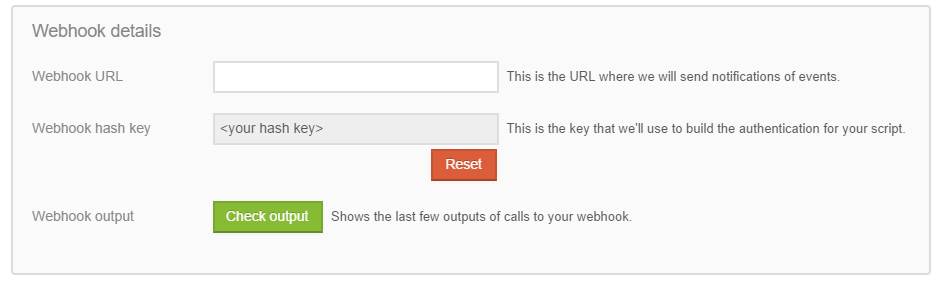

# Webhooks
Webhooks allow partners to receive notification that results are complete along with the results of scoring or verification the moment they're available. This is the fastest and most efficient way to receive results from Lenddo.

<!-- START doctoc generated TOC please keep comment here to allow auto update -->
<!-- DON'T EDIT THIS SECTION, INSTEAD RE-RUN doctoc TO UPDATE -->
**Table of Contents**

- [Webhook Setup](#webhook-setup)
- [Requirements](#requirements)
  - [Optional Configuration](#optional-configuration)
- [Webhook Call Breakdown](#webhook-call-breakdown)
  - [Payload](#payload)
- [Usage](#usage)

<!-- END doctoc generated TOC please keep comment here to allow auto update -->

## Webhook Setup
Before doing any code implementation you'll need to perform the following steps:

1. Navigate to the [Partners Dashboard](https://partners.lenddo.com) and **log in**
2. On the left hand menu click **developers** and navigate to [**settings**](https://partners.lenddo.com/developer_settings)
3. For each **partner script** that you want to receive notifications for:
    1. Take note of the **partner script id**
    2. Go to **webhook details** 
    3. Define a **webhook url** - this is the url that we will contact when results are available.
    4. Click **reset** near the **"Webhook Hash Key"** field and copy the new value.
    5. Click **save** at the bottom of the Partner Script settings.

## Requirements
You will need two pieces of information to use the authentication portion of the SDK:

1. The **Partner Script ID** found in step 3.1 of the **setup** section above.
2. The **Webhook Hash Key** found in step 3.4 of the **setup** section above.

### Optional Configuration
In addition to the standard configuration some environments may not have critical components available for proper authentication.

#### Host
You can specify a host if the internal PHP server does not see the same HOST value that our servers would send. This might happen if there is a load balancer in front of the server hosting PHP.

#### Port
Port is required if it's anything beyond the standard https port (443). If this value is anything different please provide it. Due to documented reasons we will not attempt to inspect the port the application is running on.

#### RequestPath
This field should include the path as well as the query string. Typically, this is available via `$_SERVER['REQUEST_URI'] and we will attempt to get it from this value. If however a url is being rewritten internally you will need to provide the proper value that an external party is using to communicate to this server.

## Webhook Call Breakdown
Lenddo will call your server using a **POST** request. This will be done using the [Hawk Authentication](https://github.com/hueniverse/hawk) scheme. The purpose of this SDK is to wrap the authentication scheme in an easy-to-consume class so that you can hit the ground running.

### Payload
The payload of the POST request is `application/x-www-form-urlencoded`. This means that it's similar to a user posting a form to your server. The contents of this request can be accessed via the `$_POST` superglobal in PHP.

The structure of the payload is as follows:
```php
$_POST = array(
    'APPLICATION_ID' => 'your_APPLICATION_ID_123', // this is the client id you sent to us when you passed the user to Lenddo
    'event' => 'scoring_complete',
    'result' => array(
        'score' =>  687,
        'flags' => []
    )
);
```

#### Events
Events describe why we're contacting you. There are four valid events:

##### 1. verification_complete
The application has been verified. If the verification was successful you can find the result in the `result` array. To understand how the `result` array should look like please refer to the [verification response documentation](verification_response.md) 

##### 2. scoring_complete
The application has been scored. If the scoring was successful you can find the result in the `result` array. To understand how the `result` array should look please refer to the [scoring response documentation](scoring_response.md)

##### 3. application_decision_complete
The application has received an APPROVE/DENY decision. If the decision was successful you can find the result in the `result` array. To understand how the `result` array should look please refer to the [application decision response documentation](application_decision_response.md)

##### 4. logged_in
This occurs after the user has identified with us. Because they have not been submitted to our system just yet it is not guaranteed that you will not receive another logged_in notification for this user if they cancel or return with another browser in a small window of time. No data accompanies the `result` array with this request.

## Usage
On the endpoint / URL specified in step 3.3 above you should have the following code:

```php
use Lenddo\WebhookAuthentication;

$partner_script_id = '<webhook hash key from 3.1>';
$webhook_key = '<webhook hash key from 3.4>';

// None of the following fields must be defined. Please refer to the `Optional Configuration` Above
// If your environment does not require any of the custom option values, please omit this field.
$options = array(
    'Host' => 'public.dns.com'
    'Port' => 6050,
    'RequestPath' => '/the/path/we/call?query=string&as=well'
)

// Build the Authentication Client.
$authentication_client = new WebhookAuthentication($webhook_key, $partner_script_id, $options);

// Authenticate this request
if( $authentication_client->authenticateRequest() ) {
    $post_data = $_POST;
	/**
	*
	* Authentication was successful. Here you will want to perform any business logic before calling the
	*   webhook accepted method below. The reason for this is that if the business logic failed we 
	*   will attempt again to call your server with the same payload. This allows you to not miss calls
	*   from us regardless of what may have gone wrong.
	*
	**/
	$authentication_client->webhookAccepted();
}
```
